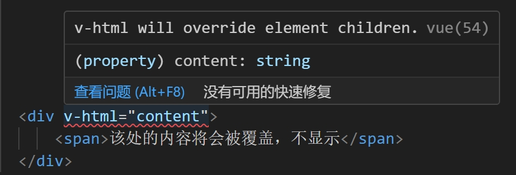
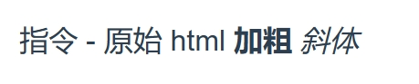

# vue 基本使用

## 1. v-html

`v-html` 指令会覆盖子组件，并且该指令会有 `xss`(cross site scripting，跨站脚本攻击) 的风险。

```vue
<template>
    <div v-html="content">
        <span>该处的内容将会被覆盖，不显示</span>
    </div>
</template>
<script>
    data() {
        return {
            content: "指令 - 原始 html <b>加粗</b> <i>斜体</i>"
        }
    }
</script>
```



vscode 编辑器会提示 `v-html will override element children.`

最终显示效果也会忽略子元素内容：



## 2. computed 和方法

计算属性 computed 是基于它们的响应式依赖进行缓存的。只在相关响应式依赖发生改变时它们才会重新求值。如果不希望有缓存，就使用方法替代。

## 3. watch

侦听器 watch 用来监听数据的变化。当需要在数据变化时执行异步或开销较大的操作时，这个方式是最有用的。

### 3.1. watch 如何深度监听

watch 默认是浅监听，监听的表层的值，不会深度监听。需要使用 `handler` 方法和 `deep: true` 才能深度监听，监听到对象的属性改变。

**watch 监听引用类型，拿不到 oldVal。**

## 4. v-if 和 v-show 的区别

`v-show` 会在 DOM 渲染中保留该元素；`v-show` 仅切换了该元素上名为 display 的 CSS 属性。 **`v-show` 不支持在 `<template>` 元素上使用，也不能和 `v-else` 搭配使用。**

v-if 是“真正”的条件渲染，因为它会确保在切换过程中条件块内的事件监听器和子组件适当地被销毁和重建。 **v-if 也是惰性的：如果在初始渲染时条件为假，则什么也不做——直到条件第一次变为真时，才会开始渲染条件块。**

相比之下，v-show 就简单得多——不管初始条件是什么，元素总是会被渲染，并且只是简单地基于 CSS 进行切换。

**v-if 有更高的切换开销，而 v-show 有更高的初始渲染开销。**

因此，如果需要非常频繁地切换，则使用 `v-show` 较好；如果在运行时条件很少改变，则使用 `v-if` 较好。

## 5. v-if 和 v-for

- 列表渲染 v-for 中，需要使用 key。

不依赖子组件状态或临时 DOM 状态 (例如：表单输入值) 的列表渲染输出时，如果数据项的顺序被改变，Vue 将不会移动 DOM 元素来匹配数据项的顺序，而是就地更新每个元素，并且确保它们在每个索引位置正确渲染。为了给 Vue 一个提示，以便它能跟踪每个节点的身份，从而重用和重新排序现有元素，你需要为每项提供一个唯一 key，这个 key 是识别节点的一个通用机制。

- 列表渲染 v-for 不能和 v-if 同时使用。

同时使用时，v-for 优先级更高，v-if 将分别重复运行于每个 v-for 循环中，影响性能。

- 列表渲染 v-for 中，可以渲染普通对象

在遍历对象时，会按 `Object.keys()` 的结果遍历

```html
<div v-for="(value, name, index) in object">
  {{ index }}. {{ name }}: {{ value }}
</div>
```

```javascript
new Vue({
  el: '#v-for-object',
  data: {
    object: {
      title: 'How to do lists in Vue',
      author: 'Jane Doe',
      publishedAt: '2016-04-10'
    }
  }
})

// 0. title: How to do lists in Vue
// 1. author: Jane Doe
// 2. publishedAt: 2016-04-10
```

- 可以在模版和组件中使用 v-for

带有 v-for 的 `<template>` 来循环渲染一段包含多个元素的内容。比如：

```html
<ul>
  <template v-for="item in items">
    <li>{{ item.msg }}</li>
    <li class="divider" role="presentation"></li>
  </template>
</ul>
```

在自定义组件上，可以像在任何普通元素上一样使用 v-for。

```html
<my-component v-for="item in items" :key="item.id"></my-component>
```