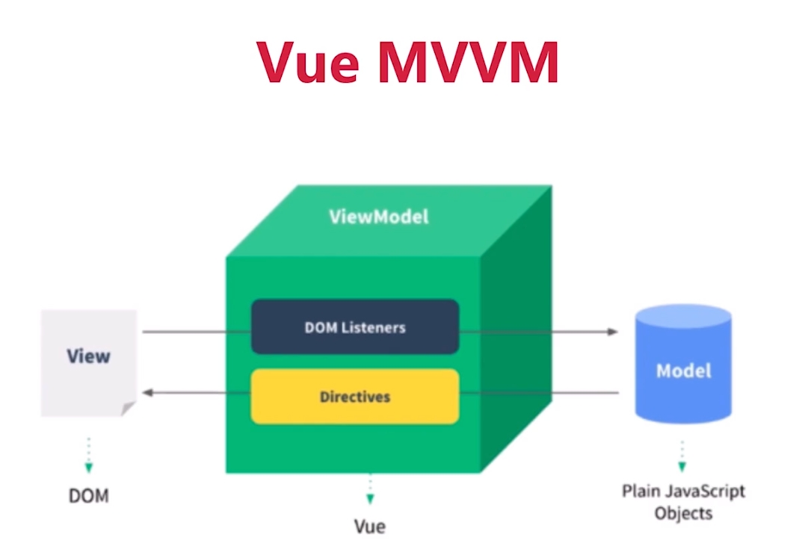

# 如何理解 MVVM

## 1. 组件化

之前的语言 asp、jsp、php 已经有了组件化，Vue、React、Angular 也有组件化，但后者有一个本质的区别：数据驱动视图。

asp、jsp、php等传统的组件化只是静态渲染，更新还需要依赖于操作 DOM（通常借助 JQuery，Jquery对操作 DOM 很便利）。而 Vue 使用 MVVM 模式实现数据驱动视图，React 使用 setState 实现数据驱动视图。不直接操作 DOM，而是修改数据，由框架来根据数据变化更新视图，更加关注于数据、逻辑和业务，不再关注 DOM 操作。

