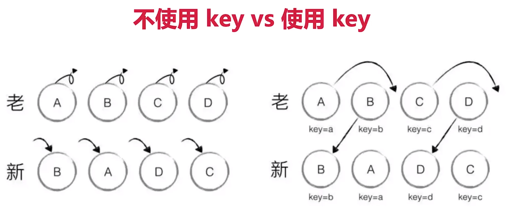

# diff 算法

VDOM 中比较 VNode 前后的最小更新范围，计算方法就是 diff 算法。它是 VDOM 中最核心、最关键的部分，能够在日常使用中体现出来（如 Vue 和 React 的列表循环里的 key 属性）。

- diff 算法（对比）是一个广泛的概念，在其他语言、工具中都有涉及，比如：linux diff命令、git diff 等。
- 两个 JS 对象也可以做对比，diff，如：[cujojs](https://www.github.com/cujojs/jiff)
- 两棵树做 diff，如 VDOM diff。

## 1. diff 算法比较节点

- 只比较同一层级，不跨级比较；
- tag 不相同，则直接删除重建，不再深度比较
- tag 和 key 都相同，则认为是相同节点，不再深度比较。

不使用 key，就会全部删掉重建，使用 key，则判断 tag 和 key，如果都相同则认为是同一节点。key 如果使用随机数也不行，key 依然匹配不上。key 如果使用 index，当排序变化了，则 key 也变化，依然认为不是同一节点。

**key 相同则只需要移动节点，不需要销毁再重建节点。**

**key 这个特殊的 attribute 主要作为 Vue 的虚拟 DOM 算法提示，在比较新旧节点列表时用于识别 VNode。**
