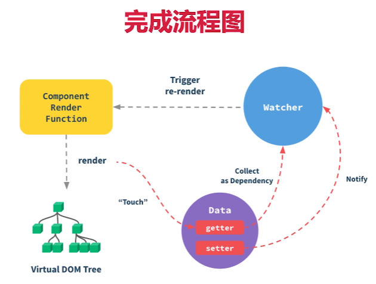

# Vue 组件是如何渲染和更新的

Vue 是异步渲染的，汇总 data 的修改，一次性更新视图，目的是减少 DOM 操作次数，提高性能。可以通过 Vue.$nextTick 判断 DOM 渲染完成。

## 1. 初次渲染过程

> 1. 通过 Vue-template-compiler 将模版解析为 render 函数；
> 2. 触发响应式，监听 data 的 getter 和 setter；
> 3. 执行 render 函数，生成 VNode，再执行 `patch(element, VNode)`。

执行 render 函数会触发 getter，因为试用了 data 中某一变量的值。模版没用到的 data 变量，不会触发 getter，因为和视图没关系。

## 2. 更新过程

> 1. 修改 data 某一变量，触发 setter（此前在 getter 中已被监听，会被观察起来）；
> 2. 重新执行 render 函数，生成 newVNode；
> 3. 执行 patch(VNode, newVNode)。

