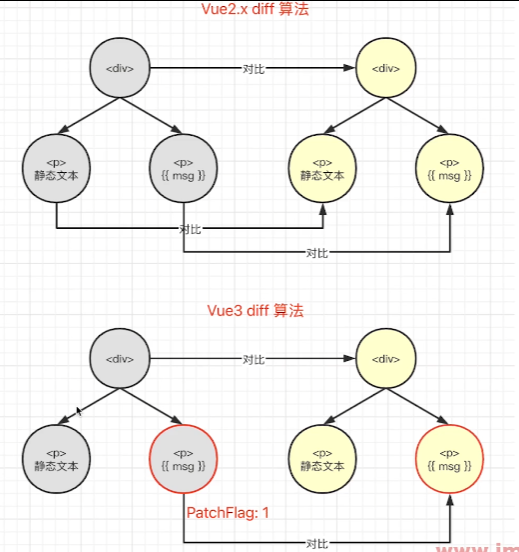

# Vue3 为何比 Vue2 快

- Proxy 响应式
- PatchFlag
- hoistStatic
- cacheHandler：缓存事件
- SSR 优化：静态节点直接输出，绕过了 VDOM。
- tree-shaking

tree-shaking 是一种优化技术，旨在减少打包后的代码大小。该技术通过分析模块之间的依赖关系，将未引用的代码从最终的打包文件中移除。

在保持代码运行结果不变的前提下，tree shaking 可以去除无用的代码，从而减小最终生成的代码大小，提高性能。

Vue3 相比 Vue2 更快的原因主要有以下几点：

1. 渲染性能提升：Vue3 采用了重写的响应式系统，使用 Proxy 对象替代了 Vue2 中的 Object.defineProperty，减少了 getter 和 setter 的开销，从而提高了渲染性能。
2. 打包体积更小：Vue3 中使用了 Tree-shaking 技术，可以在打包时自动移除未使用的代码，从而减小了打包体积。
3. 组件初始化速度更快：Vue3 中使用了静态树提升技术，可以在编译时将组件树转换为静态的渲染函数，从而优化了组件的初始化速度。
4. 采用虚拟 DOM：Vue3 采用了虚拟 DOM 来提升渲染效率，可以有效减少真实 DOM 的修改次数，从而提高组件的渲染效率。
5. 使用单向数据流：Vue3 采用单向数据流的设计模式，可以有效降低组件之间的耦合度，使得组件的渲染更加高效。
6. 采用新的编译器：Vue3 使用了新的编译器来提升模板编译效率，可以生成更加高效的代码。
7. 引入新的渲染器：Vue3 引入了新的渲染器来提升渲染效率，可以有效减少渲染过程中的中间步骤，从而提高渲染效率。

总的来说，在虚拟 DOM、单向数据流、编译器和渲染器等方面，Vue3 都有所改进，从而使得运行效率比 Vue2 更高。

https://vue-next-template-explorer.netlify.app/

## 1. Vue3 和 Vue2 的 diff 算法有什么区别

> 1. 算法基础
Vue2 使用的是基于递归的双指针的 diff 算法，而 Vue3 使用的是基于数组的动态规划的 diff 算法。
> 2. 优化技术
为了提高算法效率，Vue3 使用了一些优化技巧，例如按需更新、静态标记等。这些优化技术使得 diff 算法在处理虚拟节点时，只会对发生变化的节点进行更新，对于没有变化的节点则进行静态标记，在渲染时直接复用。

总的来说，Vue3 的 diff 算法相比 Vue2 更轻巧、更快速。
